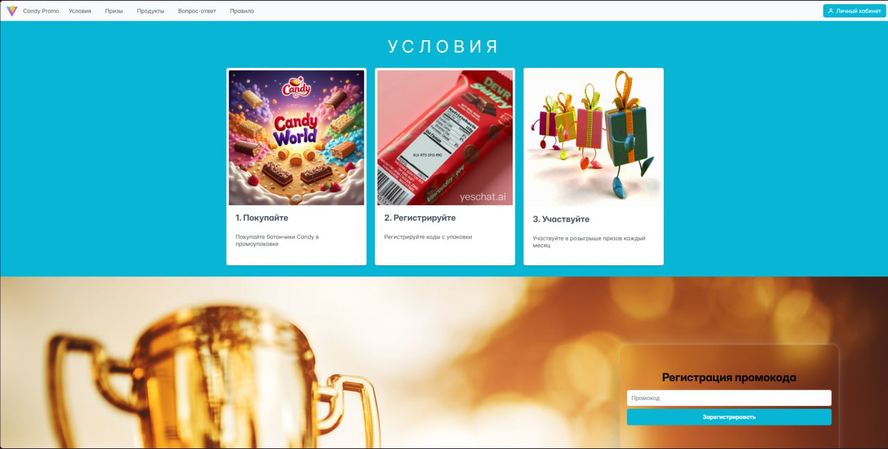
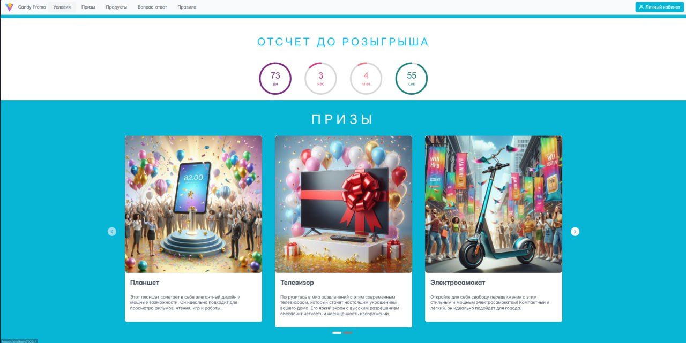
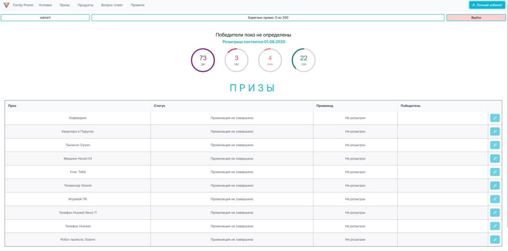
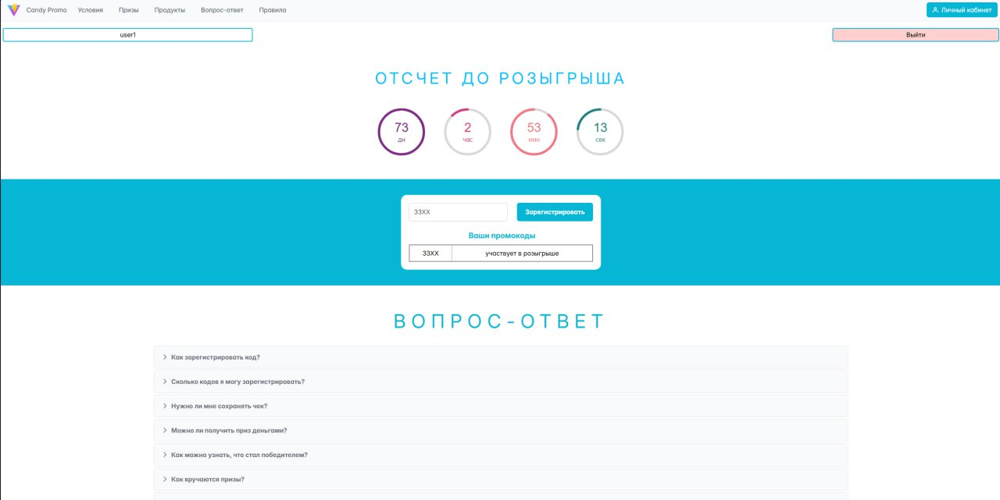

# CandyPromo
Проект сайта для ввода промокодов с упаковок шоколадок в рамках акции вымышленной кондитерской фабрики для участия в розыгрыше призов.

### Цель
Познакомиться с веб-разработкой сразу yf React, попытка создать первое для нас full-stack приложение с бекендом на уже знакомом нам asp net core.

### Планы

**Механизмы бекенда:**
- база данных с пользователями, промокодами, призами
- механизм генерации промокодов
- jwt авторизация, роли
- механизм подведения итогов (розыгрыша призов)
- валидация данных

Постараться реализовать понятную не сложную архитектуру.

**Механизмы фронтенда:**

- главная страница, страница пользователя и админка
- авторизация
- регистрация промокода
- таймер до конца акции
- информация о призах и условиях акции
- просмотр победителей (для админов)

**Технологии:**

- aspire, docker
- asp net core
- entity framework core
- postgreSQL
- react vite
- axios, interceptors
- react router
- prime react

### Результаты

Писать веб-сайты оказалось для нас довольно сложной задачей. Даже имея готовые компоненты, нам приходилось довольно сильно тупить по части css.
JavaScript оказался неочевиднее, чем C# =) Процесс верстки шел медленно и больно. А вот с бекендом проблем не было, рука уже набита. В новинку для нас был aspire, впечатления положительные, довольно удобно. Но, как и во всё, надо вникать. Думаю, у нас всё ещё впереди.

#### Скриншоты сайта

### Разработка

Для запуска проекта необходимо иметь docker desktop.
Клонируете репозиторий и запускаете проект CandyPromo.AppHost.
